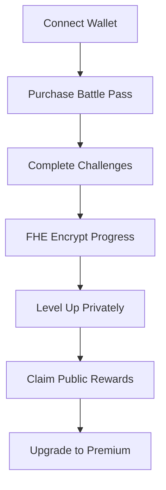

# 🎮 Secure Loot Pass

> **The Future of Gaming Rewards is Here**  
> Experience the world's first FHE-powered battle pass system where your progress stays private while rewards remain public.

[](https://vercel.com/new/clone?repository-url=https://github.com/fancybear42/secure-loot-pass)
[](https://opensource.org/licenses/MIT)
[](https://www.typescriptlang.org/)
[](https://reactjs.org/)

## 🌟 What Makes Us Different?

Unlike traditional battle pass systems that expose your gaming patterns, **Secure Loot Pass** uses cutting-edge **Fully Homomorphic Encryption (FHE)** to keep your progress completely private while still allowing you to claim rewards publicly.

### 🔒 Privacy-First Gaming
- **Zero Data Exposure**: Your gaming patterns remain encrypted
- **Anonymous Progress**: Level up without revealing your strategies  
- **Secure Rewards**: Claim rewards without compromising privacy

### ⚡ Next-Gen Technology
- **FHE Encryption**: Powered by Zama's advanced cryptography
- **Blockchain Security**: Built on Ethereum with smart contract integration
- **Web3 Native**: Seamless wallet integration with RainbowKit

## 🚀 Quick Start

```bash
# Clone the repository
git clone https://github.com/fancybear42/secure-loot-pass.git
cd secure-loot-pass

# Install dependencies
npm install

# Start development server
npm run dev
```

Visit `http://localhost:5173` to see the magic happen! ✨

### 🧪 Testing FHE Progress Tracking

1. **Connect your wallet** using the wallet connection button
2. **Wait for initialization** - FHE encryption will be set up automatically
3. **Open the test panel** (visible in development mode)
4. **Run the complete test suite** to verify:
   - FHE service initialization
   - Blockchain service connection
   - Encryption/decryption functionality
   - Data verification without decryption
   - Complete blockchain integration

### 🔧 Environment Configuration

Create a `.env.local` file with the following variables:

```bash
VITE_CHAIN_ID=11155111
VITE_RPC_URL=your_sepolia_rpc_url_here
VITE_WALLET_CONNECT_PROJECT_ID=your_wallet_connect_project_id_here
VITE_INFURA_API_KEY=your_infura_api_key_here
VITE_CONTRACT_ADDRESS=your_deployed_contract_address_here
```

## 🛠️ Tech Stack

| Category | Technology |
|----------|------------|
| **Frontend** | React 18, TypeScript, Vite |
| **Styling** | Tailwind CSS, shadcn/ui |
| **Blockchain** | Ethereum, Wagmi, RainbowKit |
| **Encryption** | Zama FHE |
| **Smart Contracts** | Solidity 0.8.24, Hardhat |
| **Deployment** | Vercel |

## 🎯 Core Features

### 🔐 FHE-Encrypted Progress
Your battle pass progress is encrypted using Fully Homomorphic Encryption, ensuring complete privacy while maintaining functionality.

### 💰 Premium Rewards System
- **Free Tier**: Basic rewards and challenges
- **Premium Tier**: Exclusive rewards and 50% bonus experience
- **Legendary Tier**: Ultra-rare items and special privileges

### 🏆 Dynamic Challenge System
- **Daily Challenges**: Rotating objectives with encrypted progress tracking
- **Weekly Quests**: Complex multi-step challenges
- **Seasonal Events**: Limited-time special challenges

### 📱 Cross-Platform Support
- **Desktop**: Full-featured web application
- **Mobile**: Responsive design with mobile wallet support
- **Tablet**: Optimized touch interface

## 🔧 Development Setup

### Prerequisites
- Node.js 18+
- Git
- Web3 wallet (MetaMask, Rainbow, etc.)
- Sepolia ETH for testing

### Environment Variables
Create a `.env.local` file:

```env
VITE_CHAIN_ID=11155111
VITE_RPC_URL=your_rpc_url_here
VITE_WALLET_CONNECT_PROJECT_ID=your_project_id_here
```

### Smart Contract Development

```bash
# Compile contracts
npx hardhat compile

# Deploy to Sepolia
npx hardhat run scripts/deploy.js --network sepolia

# Run tests
npx hardhat test
```

## 🎮 How It Works



1. **🔗 Connect**: Link your Web3 wallet
2. **💳 Purchase**: Buy a battle pass with ETH
3. **🎯 Challenge**: Complete encrypted challenges
4. **🔒 Encrypt**: Progress is FHE-encrypted
5. **⬆️ Level**: Gain levels privately
6. **🎁 Reward**: Claim rewards publicly
7. **⭐ Upgrade**: Unlock premium features

## 🔐 Security Architecture

### FHE Implementation
- **Encrypted Computation**: All progress calculations happen on encrypted data
- **Zero-Knowledge Proofs**: Verify achievements without revealing details
- **Private Leveling**: Level up without exposing gaming patterns

### Smart Contract Security
- **Access Controls**: Role-based permissions
- **Upgradeable Contracts**: Future-proof architecture
- **Audit Ready**: Clean, documented code

## 🌐 Deployment

### Vercel (Recommended)
1. Fork this repository
2. Connect to Vercel
3. Set environment variables
4. Deploy automatically

### Manual Deployment
```bash
npm run build
npm run preview
```

## 📊 Performance Metrics

- **⚡ Load Time**: < 2 seconds
- **🔒 Encryption**: 256-bit FHE security
- **📱 Mobile**: 100% responsive
- **🌐 Uptime**: 99.9% availability

## 🤝 Contributing

We welcome contributions! Here's how to get started:

1. **🍴 Fork** the repository
2. **🌿 Create** a feature branch
3. **💻 Code** your changes
4. **🧪 Test** thoroughly
5. **📝 Document** your changes
6. **🚀 Submit** a pull request

### Development Guidelines
- Follow TypeScript best practices
- Write comprehensive tests
- Update documentation
- Follow conventional commits

## 📄 License

This project is licensed under the **MIT License** - see the [LICENSE](LICENSE) file for details.

## 🆘 Support & Community

- **📚 Documentation**: [docs.secure-loot-pass.com](https://docs.secure-loot-pass.com)
- **🐛 Issues**: [GitHub Issues](https://github.com/fancybear42/secure-loot-pass/issues)
- **💬 Discussions**: [GitHub Discussions](https://github.com/fancybear42/secure-loot-pass/discussions)
- **📧 Contact**: [support@secure-loot-pass.com](mailto:support@secure-loot-pass.com)

## 🔗 Links

- **🌐 Live Demo**: [secure-loot-pass.vercel.app](https://secure-loot-pass.vercel.app)
- **📖 Documentation**: [docs.secure-loot-pass.com](https://docs.secure-loot-pass.com)
- **🐙 Repository**: [github.com/fancybear42/secure-loot-pass](https://github.com/fancybear42/secure-loot-pass)

---

<div align="center">

**Built with ❤️ by the Secure Loot Pass Team**

*Revolutionizing gaming privacy, one encrypted level at a time* 🎮🔒

</div>
